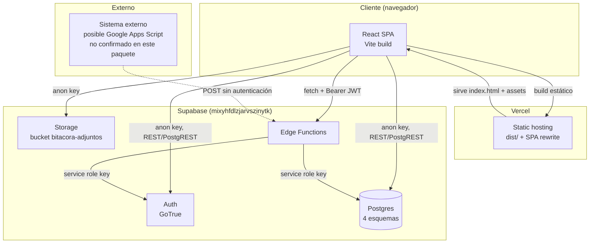
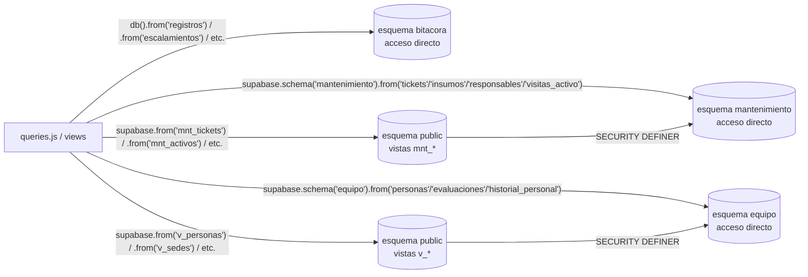
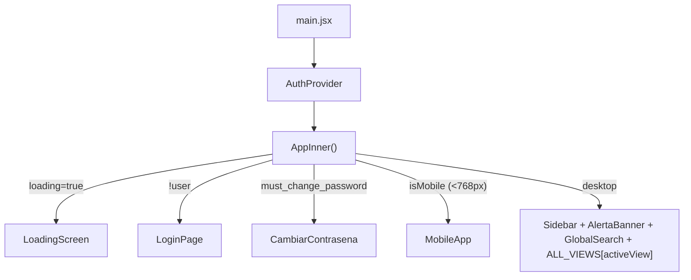
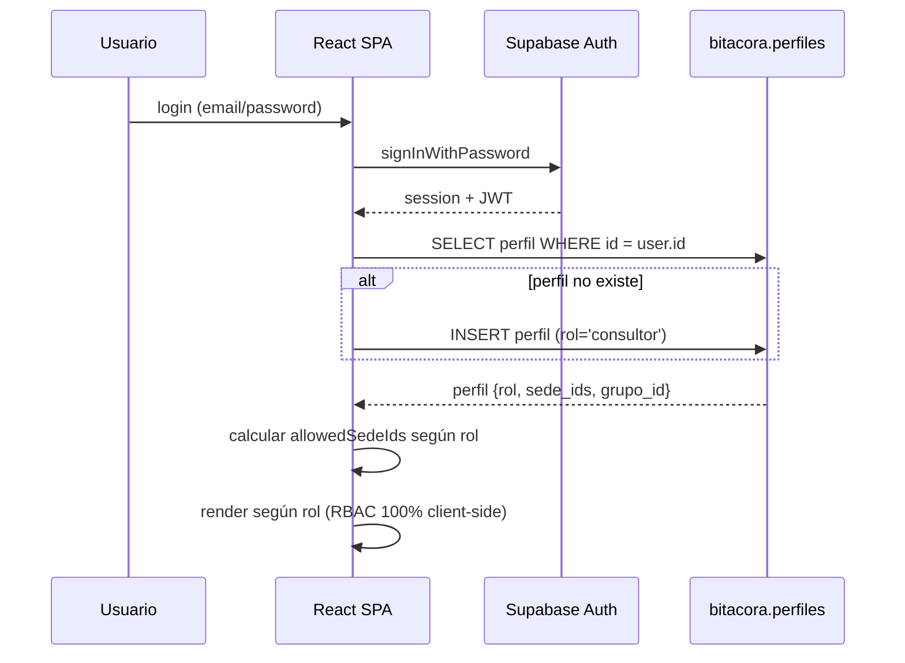

# ARCHITECTURE — bitacora-dashboard

> Verificado contra código fuente real (`src/App.jsx`, `src/lib/auth.jsx`, `src/lib/supabase.js`, `src/lib/queries.js`) y contra el proyecto Supabase `mixyhfdlzjarvszinytk` en vivo. Fecha de verificación: 2026-06-17.

## 1. Visión general

SPA de React servida como archivos estáticos desde Vercel, sin backend propio. Toda la persistencia y autenticación corre contra Supabase (Postgres + Auth + Storage + 3 Edge Functions puntuales). No hay servidor intermedio, no hay capa de API REST propia: el cliente habla directo con la API autogenerada de Supabase (PostgREST) usando la `anon key`.



## 2. Patrón de acceso a datos (confirmado en `src/lib/queries.js`)

El cliente Supabase se instancia una sola vez en `src/lib/supabase.js`:

```js
export const supabase = createClient(supabaseUrl, supabaseAnonKey)
export const db = () => supabase.schema('bitacora')
```

A partir de ahí hay **dos rutas de acceso distintas y deliberadas**:



⚠️ **Corrección respecto a una versión anterior de este documento**: se había documentado que el frontend "nunca" llama `supabase.schema('mantenimiento')` ni `supabase.schema('equipo')` y que el acceso a esos esquemas era exclusivamente vía vistas `public`. Una verificación exhaustiva de **todos** los call sites `.schema(...)` en `src/` (no solo `queries.js`) refuta esa regla absoluta: el frontend mezcla ambos patrones de forma inconsistente, archivo por archivo. Detalle completo y file-by-file en API.md §3.1.

- **`bitacora`**: acceso directo vía `db()` → `supabase.schema('bitacora')`. El frontend lee y escribe las 17 tablas de este esquema directamente.
- **`mantenimiento` y `equipo` — patrón mixto, no exclusivo de vistas**: gran parte del código sí pasa por las 20 vistas `SECURITY DEFINER` expuestas en `public` (`mnt_activos`, `mnt_tickets`, `mnt_ejecuciones`, `mnt_planes`, `mnt_proveedores`, `mnt_matafuegos`, `mnt_insumos`, `mnt_movimientos`, `mnt_plan_checklist`, `mnt_responsables`, `mnt_ticket_costos`, `mnt_visitas`, `mnt_historial`, `v_personas`, `v_sedes`, `v_evaluaciones`, `v_historial_personal`, `v_logros_config`, `v_logros_obtenidos`, `v_auditoria`). Pero otros módulos llaman `supabase.schema('mantenimiento')`/`supabase.schema('equipo')` **directo** contra las tablas reales: `EquipoView.jsx` (escrituras en `personas`, `evaluaciones`, `historial_personal`), `MntVehiculos.jsx` y `queries.js:getEventosMantenimiento` (`mantenimiento.tickets`), `MntInsumos.jsx` (`mantenimiento.insumos`), `MntResponsables.jsx` (`mantenimiento.responsables`/`reglas_escalacion`), `QRActivoView.jsx` (`mantenimiento.visitas_activo`).
- Además, `SedeFicha.jsx` tiene un bug confirmado: llama `.schema('mantenimiento').from('mnt_tickets'/'mnt_activos')`, pero esos nombres son vistas que solo existen en `public`, no en `mantenimiento` — la llamada apunta a una relación que no existe en ese esquema. Detalle en API.md §3.2 y KNOWN_ISSUES.md.

La intención original de la separación por vistas era probablemente no exponer los esquemas internos directamente vía RLS granular, delegando el control de acceso a las vistas con `SECURITY DEFINER`. En la práctica esa intención no se sostuvo de forma consistente, y además la mayoría de las políticas RLS subyacentes son permisivas (`qual: true`) o están deshabilitadas, por lo que el aislamiento real que aporta este patrón es limitado incluso donde sí se respeta — ver matriz completa de grants/RLS efectivos por tabla en API.md §3.4 y KNOWN_ISSUES.md.

## 3. Navegación (sin router)

No hay `react-router` ni ninguna librería de ruteo. La navegación es estado local puro:



`App.jsx` define un objeto `ALL_VIEWS` con 26 entradas (clave string → componente). `activeView` es un `useState` que se actualiza con una función `navigate(view)`. Casos especiales confirmados en código:

- Parámetro de URL `?scan=activo&id=...` fuerza `activeView = 'qrActivo'` al cargar (flujo de escaneo de QR de activos).
- Roles `encargado` y `sede` son redirigidos automáticamente a la vista `sedeEncargado`, sin acceso al resto del menú.
- `navigate('usuarios')` está bloqueado en código para cualquier rol que no sea `admin` (chequeo en el propio `navigate`, no solo ocultamiento de UI).
- Atajo de teclado Ctrl/Cmd+K abre el buscador global (`GlobalSearch`).
- `useEscalamientosAlert({ sedeIds: allowedSedeIds, enabled: !loading && !!user && !isMobile })`: sistema de notificaciones de navegador para escalamientos, deshabilitado en mobile.

## 4. Responsive: dos UIs distintas, no una sola adaptativa

`useIsMobile()` (breakpoint 768px) decide entre dos árboles de componentes completamente separados: `MobileApp` (con `MobileHome`, `MobileReporte`, `MobileChecklist`, `MobileEscalamientos`, `MobileSedes`, `MobileTareas`) vs. el set de vistas de escritorio (`Sidebar` + `ALL_VIEWS`). No es un único set de componentes con CSS responsive — son implementaciones separadas que consumen funciones de `queries.js` en común (ej. `MobileHome` usa `getMisRegistrosHoy`, `getMisTareas`, las mismas que probablemente alimentan vistas de escritorio).

## 5. Autenticación y autorización (resumen — detalle en BUSINESS_RULES.md)



Todo el cálculo de `allowedSedeIds` ocurre en `src/lib/auth.jsx`, en el cliente. No hay políticas RLS equivalentes que reproduzcan esta misma lógica de restricción por sede a nivel de base — el control real de "qué sede puede ver cada usuario" depende de que el frontend respete `allowedSedeIds` al armar sus queries, no de una barrera en la base de datos.

## 6. Edge Functions (detalle completo en API.md)

Tres funciones activas, las tres con `verify_jwt: false` a nivel de gateway (la validación de JWT, cuando existe, la hace el código de cada función):

- `invite-user` — invitada por admins, crea usuario + perfil.
- `admin-user-actions` — reset de contraseña, reenvío de invitación, borrado de usuario.
- `bitacora-ingest` — inserta filas en `bitacora.registros`; **no tiene ninguna verificación de autenticación en su código**, a diferencia de las otras dos. No está referenciada en ningún punto de `src/`, lo que sugiere que la consume un sistema externo (posiblemente vinculado a los hallazgos previos sobre "Ejecuciones de Apps Script" del hilo de diagnóstico de gaps de novedades — no confirmado de forma directa en este paquete de verificación).

## 7. Build y despliegue (detalle en DEPLOYMENT.md)

Vite build → `dist/` → Vercel (hosting estático + rewrite SPA `/(.*) → /index.html`). Deploy 100% manual vía `DEPLOY.bat` (`npx vercel --prod --yes`), sin CI/CD. El `postinstall` script (`scripts/postinstall.cjs`) aplica un shim manual a `node_modules/@supabase/phoenix/priv/static/phoenix.mjs` porque el paquete `@supabase/phoenix` no lo incluye en algunas versiones — es un parche de fragilidad de dependencias, no una decisión de arquitectura.

## 8. Decisiones arquitectónicas notables

| Decisión | Razón aparente | Riesgo |
|---|---|---|
| Sin router, navegación por estado | Simplicidad para una app interna pequeña | No hay URLs profundas salvo el caso `?scan=activo`; no se puede compartir un link directo a una vista |
| RBAC client-side | Velocidad de desarrollo | Sin barrera real en la base de datos (ver KNOWN_ISSUES.md) |
| Acceso a `mantenimiento`/`equipo` (intención: solo vía vistas `public`) | Aislar esquemas internos | No se aplica de forma consistente (varios módulos acceden directo a las tablas reales, ver §2) y, donde sí se aplica, el aislamiento es parcial porque las políticas RLS subyacentes son en su mayoría permisivas o están deshabilitadas |
| Dos UIs (desktop/mobile) en vez de una responsive | UX mobile a medida | Duplicación de código y mantenimiento doble de algunas pantallas |
| Deploy manual sin CI/CD | Proyecto chico, un solo desarrollador (presumido, no confirmado) | Sin gate de calidad antes de producción |
