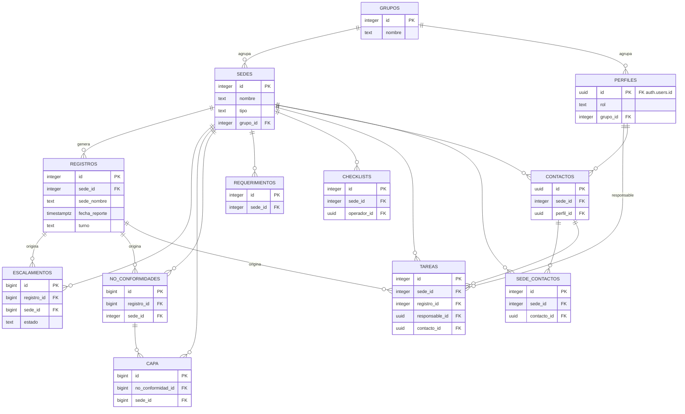
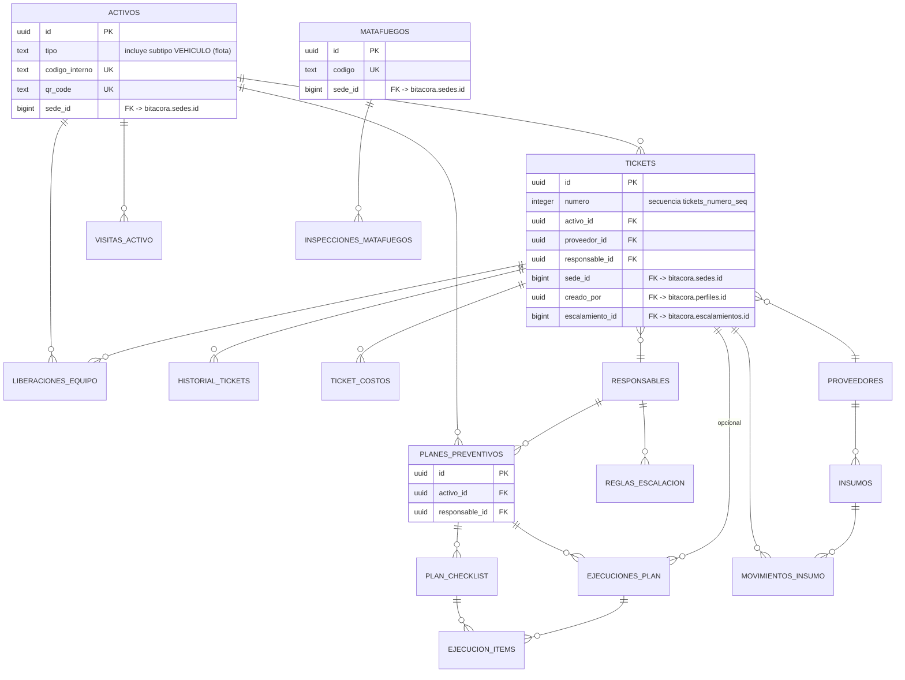
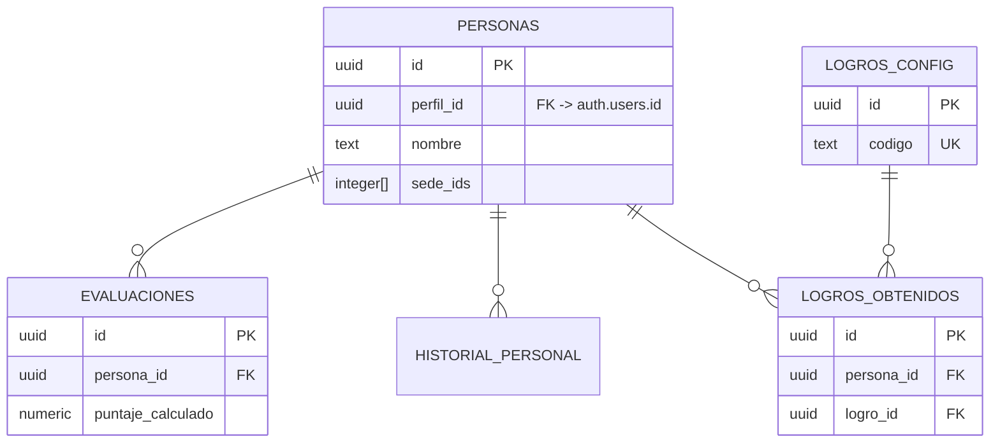

# DATABASE — bitacora-dashboard

> Verificado en vivo contra el proyecto Supabase `mixyhfdlzjarvszinytk` mediante `information_schema.columns`, `information_schema.table_constraints` y `pg_constraint` (no contra memoria de sesiones previas). Fecha de verificación: 2026-06-17. Todo dato no verificable de forma directa está marcado explícitamente.

## 1. Resumen de esquemas

| Esquema | Tablas | Acceso desde frontend | Contenido |
|---|---|---|---|
| `bitacora` | 17 | Directo (`supabase.schema('bitacora')`) | Novedades diarias, escalamientos, no conformidades, CAPA, tareas, sedes, perfiles/usuarios, requerimientos, checklists de turno, adjuntos, auditoría |
| `mantenimiento` | 17 | Indirecto, solo vía 13 vistas `mnt_*` en `public` (`SECURITY DEFINER`) | Activos (incluye flota de vehículos como subtipo), tickets, planes preventivos, proveedores, insumos, matafuegos, responsables |
| `equipo` | 5 | Indirecto, solo vía 7 vistas `v_*` en `public` (`SECURITY DEFINER`) | Personas (RRHH), evaluaciones, historial disciplinario/laboral, logros |
| `public` | 20 vistas proxy + 11 tablas de otra aplicación | Las 20 vistas sí; las 11 tablas ajenas no están relacionadas con Fly Kitchen (no se detallan aquí) | Capa de exposición controlada de `mantenimiento`/`equipo` |

Esto reproduce exactamente lo verificado en ARCHITECTURE.md §2 — no es una segunda fuente independiente, sino el mismo hecho confirmado ahora a nivel de columnas y constraints.

## 2. Diagramas entidad-relación

Se dividen por esquema para que sean legibles. Solo se muestran PK/FK relevantes para la relación; el detalle completo de columnas está en la sección 3.

### 2.1 Esquema `bitacora`

Tablas de `bitacora` sin relaciones FK entrantes/salientes dentro del propio esquema (verificado — no aparecen en el mapa de constraints): `adjuntos`, `audit_log`, `auditoria`, `checklist_items`, `errores_ingesta`. Son tablas de bitácora técnica/auditoría o catálogo, referenciadas por convención de `entity_type`/`entity_id` (texto libre, no FK real) en el caso de `adjuntos`.

### 2.2 Esquema `mantenimiento`

Cross-schema confirmado (FK reales a nivel de Postgres, no solo convención de nombres): `mantenimiento.activos.sede_id`, `mantenimiento.matafuegos.sede_id` y `mantenimiento.tickets.sede_id` apuntan a `bitacora.sedes.id`; `mantenimiento.tickets.creado_por` apunta a `bitacora.perfiles.id`; `mantenimiento.tickets.escalamiento_id` apunta a `bitacora.escalamientos.id`. Esto es relevante porque contradice parcialmente la idea de "esquemas aislados": el aislamiento es solo a nivel de **acceso desde el frontend** (vistas `SECURITY DEFINER`), no a nivel de integridad referencial real en la base.

### 2.3 Esquema `equipo`

`equipo.personas.perfil_id` apunta directo a `auth.users.id` (confirmado vía `pg_constraint`), **no** a `bitacora.perfiles.id` — son dos vínculos paralelos e independientes hacia la tabla de autenticación de Supabase, no uno anidado dentro del otro. Quien edite este esquema debe tenerlo presente: actualizar `bitacora.perfiles` no actualiza ni valida `equipo.personas.perfil_id`.

### 2.4 Referencias hacia `auth.users` (esquema de Supabase Auth, fuera de `bitacora`/`mantenimiento`/`equipo`)

Confirmado vía `pg_constraint` (estas FKs no aparecen con su tabla destino en `information_schema.constraint_column_usage` porque esa vista no expone metadatos de `auth` para este rol; se resolvieron consultando `pg_constraint.confrelid` directamente):

| Tabla.columna | Referencia |
|---|---|
| `bitacora.perfiles.id` | `auth.users.id` |
| `bitacora.audit_log.usuario_id` | `auth.users.id` |
| `bitacora.capa.created_by` | `auth.users.id` |
| `bitacora.checklists.operador_id` | `auth.users.id` |
| `bitacora.no_conformidades.created_by` | `auth.users.id` |
| `equipo.personas.perfil_id` | `auth.users.id` |
| `mantenimiento.ticket_costos.created_by` | `auth.users.id` |
| `mantenimiento.visitas_activo.created_by` | `auth.users.id` |

## 3. Detalle de columnas por tabla

Formato: `columna : tipo` — `NN` (NOT NULL) o `N` (nullable) — default si existe. PK marcada con 🔑, FK con 🔗.

### 3.1 Esquema `bitacora`

**sedes** (17 columnas → resumido en PK/relevantes)
| Columna | Tipo | Nulo | Default |
|---|---|---|---|
| 🔑 id | integer | NO | `nextval(sedes_id_seq)` |
| nombre | text | NO | — (UNIQUE) |
| tipo | text | NO | — |
| responsable | text | YES | — |
| email | text | YES | — |
| activa | boolean | NO | `true` |
| created_at | timestamptz | NO | `now()` |
| direccion | text | YES | — |
| lat / lng | double precision | YES | — |
| telefono | text | YES | — |
| contacto_nombre | text | YES | — |
| descripcion | text | YES | — |
| 🔗 grupo_id | integer | YES | → `grupos.id` |

**grupos**
| Columna | Tipo | Nulo | Default |
|---|---|---|---|
| 🔑 id | integer | NO | `nextval(grupos_id_seq)` |
| nombre | text | NO | — |
| slug | text | NO | — (UNIQUE) |
| color | text | YES | `'#6B7280'` |
| activo | boolean | YES | `true` |
| created_at | timestamptz | YES | `now()` |

**perfiles**
| Columna | Tipo | Nulo | Default |
|---|---|---|---|
| 🔑🔗 id | uuid | NO | — (→ `auth.users.id`, sin default propio) |
| nombre | text | NO | — |
| email | text | NO | — |
| rol | text | NO | **`'Consultor'`** ⚠️ capitalizado — el frontend usa roles en minúscula (ver KNOWN_ISSUES.md) |
| sede_ids | integer[] | YES | `'{}'` |
| activo | boolean | YES | `true` |
| created_at / updated_at | timestamptz | YES | `now()` |
| telefono | text | YES | — |
| 🔗 grupo_id | integer | YES | → `grupos.id` |
| must_change_password | boolean | YES | `false` |

**registros** (la tabla central del módulo Bitácora/Novedades)
| Columna | Tipo | Nulo | Default |
|---|---|---|---|
| 🔑 id | integer | NO | `nextval(registros_id_seq)` |
| fecha_reporte | timestamptz | NO | — |
| 🔗 sede_id | integer | YES | → `sedes.id` |
| sede_nombre | text | NO | — |
| turno | text | YES | — |
| reportante / email_reportante | text | YES | — |
| nivel_actividad / estado_general | text | YES | — |
| origen_form | text | NO | — |
| estado_a..estado_h / detalle_a..detalle_h | text | YES | — (8 pares de campos de checklist por categoría) |
| requiere_escalamiento | boolean | NO | `false` |
| motivo_escalamiento / escalado_a | text | YES | — |
| link_evidencia | text | YES | — |
| op1_producidos / op1_servidos / op1_sobrante / op2_producidos / op2_servidos / op2_sobrante / vegetariano_producidos / vegetariano_servidos / vegetariano_sobrante / ensalada_producidos / ensalada_sobrante / postre_producidos / postre_sobrante | integer | YES | — (conteo de producción, servicio y sobrante de comedor) |
| created_at | timestamptz | NO | `now()` |
| tipo | text | YES | — |

**escalamientos**
| Columna | Tipo | Nulo | Default |
|---|---|---|---|
| 🔑 id | bigint | NO | `nextval(escalamientos_id_seq)` |
| 🔗 registro_id | bigint | YES | → `registros.id` |
| tipo | text | NO | — |
| descripcion | text | NO | — |
| destino | text | YES | — |
| estado | text | NO | `'Pendiente'` |
| sede_id | bigint | YES | — (sin FK declarada a nivel de constraint, pese al nombre) |
| sede_nombre | text | YES | — |
| reportante | text | YES | — |
| fecha_reporte | date | YES | — |
| created_at / updated_at | timestamptz | YES | `now()` |

**no_conformidades**
| Columna | Tipo | Nulo | Default |
|---|---|---|---|
| 🔑 id | bigint | NO | `nextval(...)` |
| codigo | text | NO | — (UNIQUE) |
| fecha_apertura | timestamptz | YES | `now()` |
| fecha_cierre | timestamptz | YES | — |
| 🔗 sede_id | integer | YES | → `sedes.id` |
| sede_nombre | text | YES | — |
| descripcion | text | NO | — |
| categoria / causa_raiz | text | YES | — |
| estado | text | NO | `'Abierta'` |
| responsable | text | YES | — |
| 🔗 registro_id | bigint | YES | → `registros.id` |
| 🔗 created_by | uuid | YES | → `auth.users.id` |
| created_at / updated_at | timestamptz | YES | `now()` |

**capa** (acciones correctivas/preventivas)
| Columna | Tipo | Nulo | Default |
|---|---|---|---|
| 🔑 id | bigint | NO | `nextval(...)` |
| codigo | text | NO | — (UNIQUE) |
| tipo | text | NO | — |
| 🔗 no_conformidad_id | bigint | YES | → `no_conformidades.id` |
| descripcion | text | NO | — |
| responsable | text | YES | — |
| fecha_limite | date | YES | — |
| fecha_cierre | timestamptz | YES | — |
| estado | text | NO | `'Pendiente'` |
| evidencia | text | YES | — |
| eficacia_verificada | boolean | YES | `false` |
| 🔗 created_by | uuid | YES | → `auth.users.id` |
| created_at / updated_at | timestamptz | YES | `now()` |
| 🔗 sede_id | bigint | YES | → `sedes.id` |
| sede_nombre / auditoria_codigo / notas | text | YES | — |

**tareas**
| Columna | Tipo | Nulo | Default |
|---|---|---|---|
| 🔑 id | integer | NO | `nextval(...)` |
| titulo | text | NO | — |
| 🔗 sede_id | integer | YES | → `sedes.id` |
| 🔗 registro_id | integer | YES | → `registros.id` |
| categoria | text | YES | — |
| responsable | text | YES | — |
| prioridad | text | NO | `'Media'` |
| estado | text | NO | `'Pendiente'` |
| fecha_limite | date | YES | — |
| notas_resolucion | text | YES | — |
| created_at / updated_at | timestamptz | NO | `now()` |
| 🔗 responsable_id | uuid | YES | → `perfiles.id` |
| 🔗 contacto_id | uuid | YES | → `contactos.id` |
| descripcion | text | YES | — |
| subtareas | jsonb | YES | `'[]'` |
| intervinientes | jsonb | NO | `'[]'` |
| 🔗 creado_por | uuid | YES | → `perfiles.id` (`ON DELETE SET NULL`) |

**requerimientos** (pedidos de compra/insumos por sede)
| Columna | Tipo | Nulo | Default |
|---|---|---|---|
| 🔑 id | integer | NO | `nextval(...)` |
| numero | integer | NO | — |
| 🔗 sede_id | integer | YES | → `sedes.id` |
| sede_nombre / solicitante | text | YES | — |
| cantidad | numeric | YES | — |
| unidad_medida | text | YES | — |
| descripcion | text | NO | — |
| periodo_consumo / justificacion / funcion / sector_maquina / proveedor_sugerido | text | YES | — |
| tipo_compra | text | YES | `'reposicion'` |
| comentarios / imagen_url | text | YES | — |
| urgencia | text | YES | `'media'` |
| estado | text | YES | `'Pendiente'` — flujo ampliado localmente el 2026-06-19; migración pendiente de aplicar |
| fecha_necesidad | date | YES | — |
| enviado_a | text | YES | — |
| enviado_at / created_at / updated_at | timestamptz | YES | — / `now()` / `now()` |
| aprobado_at / compra_iniciada_at / recibido_at / cumplido_at | timestamptz | YES | — (pendiente migración `20260619_requerimientos_proceso_kpis.sql`) |
| observado_at / rechazado_at / cancelado_at | timestamptz | YES | — (pendiente misma migración) |
| fecha_compromiso | date | YES | — |
| observacion_aprobacion | text | YES | — |
| sla_dias | integer | YES | —; se congela al enviar a Compras |
| historial_estados | jsonb | NO | `'[]'` (después de aplicar la migración) |

**push_subscriptions / notificaciones** *(propuesta local pendiente de aprobación y migración)*

- `push_subscriptions` registra endpoints Web Push por `auth.users.id`, claves públicas del dispositivo, estado y última actividad. RLS propuesta: cada autenticado sólo gestiona sus propios dispositivos.
- `notificaciones` conserva la bandeja personal, módulo/entidad, prioridad, URL, deduplicación y marcas de lectura/atención. RLS propuesta: cada autenticado sólo lee y actualiza las propias; únicamente la Edge Function con `service_role` inserta.
- SQL completo: `supabase/migrations/20260619_push_notifications.sql`. No fue aplicado a producción al redactar esta sección.

**checklists** (checklist de turno — distinto de `mantenimiento.plan_checklist`, ver nota en §5)
| Columna | Tipo | Nulo | Default |
|---|---|---|---|
| 🔑 id | integer | NO | `nextval(...)` |
| 🔗 sede_id | integer | NO | → `sedes.id` |
| sede_nombre / tipo / turno | text | YES/NO | — |
| fecha | date | NO | `CURRENT_DATE` |
| 🔗 operador_id | uuid | YES | → `auth.users.id` |
| operador_nombre | text | YES | — |
| items | jsonb | NO | `'{}'` |
| items_ok / items_total | integer | NO | `0` |
| observaciones | text | YES | — |
| created_at | timestamptz | YES | `now()` |

**checklist_items** (catálogo de ítems posibles, sin FK — referenciado por convención desde `items` jsonb de `checklists`)
| Columna | Tipo | Nulo | Default |
|---|---|---|---|
| 🔑 id | integer | NO | `nextval(...)` |
| tipo / categoria / texto | text | NO | — |
| orden | integer | NO | `0` |
| activo | boolean | NO | `true` |
| created_at | timestamptz | YES | `now()` |

**contactos**
| Columna | Tipo | Nulo | Default |
|---|---|---|---|
| 🔑 id | uuid | NO | `gen_random_uuid()` |
| nombre | text | NO | — |
| cargo / telefono | text | YES | — |
| email | text | YES | — (UNIQUE) |
| 🔗 sede_id | integer | YES | → `sedes.id` |
| activo | boolean | NO | `true` |
| created_at | timestamptz | NO | `now()` |
| 🔗 perfil_id | uuid | YES | → `perfiles.id` |

**sede_contactos** (tabla puente N:M)
| Columna | Tipo | Nulo | Default |
|---|---|---|---|
| 🔑 id | integer | NO | `nextval(...)` |
| 🔗 sede_id | integer | NO | → `sedes.id` |
| 🔗 contacto_id | uuid | NO | → `contactos.id` |
| rol | text | NO | `'Responsable'` |
| activo | boolean | NO | `true` |
| created_at | timestamptz | YES | `now()` |
| | | | UNIQUE (sede_id, contacto_id) |

**adjuntos** (genérico, sin FK declarada — vincula por `entity_type`/`entity_id` en texto)
| Columna | Tipo | Nulo | Default |
|---|---|---|---|
| 🔑 id | bigint | NO | `nextval(...)` |
| entity_type | text | NO | — |
| entity_id | text | NO | — (permite IDs numéricos y UUID; cambiado 2026-06-19) |
| nombre | text | NO | — |
| tipo | text | NO | `'archivo'` |
| url | text | NO | — |
| storage_path / mime_type / descripcion / uploaded_by | text/bigint | YES | — |
| tamaño_bytes | bigint | YES | — |
| created_at | timestamptz | YES | `now()` |

**auditoria**
| Columna | Tipo | Nulo | Default |
|---|---|---|---|
| 🔑 id | bigint | NO | `nextval(...)` |
| tabla / accion | text | NO | — |
| registro_id / descripcion / campo / valor_antes / valor_nuevo | text | YES | — |
| cambios_json | jsonb | YES | — |
| usuario_id | uuid | YES | — (sin FK declarada) |
| usuario_email / usuario_nombre | text | YES | — |
| sede_id | bigint | YES | — (sin FK declarada) |
| sede_nombre / ip_address | text | YES | — |
| created_at | timestamptz | NO | `now()` |

**audit_log** (tabla distinta de `auditoria` — solapamiento de propósito, ver §5)
| Columna | Tipo | Nulo | Default |
|---|---|---|---|
| 🔑 id | bigint | NO | `nextval(...)` |
| 🔗 usuario_id | uuid | YES | → `auth.users.id` |
| usuario_nombre / accion / tabla / registro_id | text | YES/NO | — |
| detalle | jsonb | YES | — |
| created_at | timestamptz | YES | `now()` |

**errores_ingesta** (log de fallos del Edge Function `bitacora-ingest`)
| Columna | Tipo | Nulo | Default |
|---|---|---|---|
| 🔑 id | bigint | NO | `nextval(...)` |
| created_at | timestamptz | YES | `now()` |
| origen_form / sede_nombre / payload_raw / error_code / error_detalle | text | YES | — |
| resuelto | boolean | YES | `false` |

### 3.2 Esquema `mantenimiento`

**activos**
| Columna | Tipo | Nulo | Default |
|---|---|---|---|
| 🔑 id | uuid | NO | `gen_random_uuid()` |
| codigo_interno | text | YES | — (UNIQUE) |
| tipo | text | NO | — (incluye subtipo `VEHICULO` para flota) |
| nombre / marca / modelo / numero_serie / categoria / sede / responsable | text | YES/NO | — |
| estado | text | YES | `'operativo'` |
| estado_notas | text | YES | — |
| estado_cambiado_at | timestamptz | YES | — |
| km_actual | integer | YES | `0` |
| qr_code | text | YES | — (UNIQUE) |
| manual_url / foto_url | text | YES | — |
| fecha_compra | date | YES | — |
| proveedor_compra | text | YES | — |
| vencimiento_seguro / vencimiento_vtv / vencimiento_senasa / vencimiento_rmtsa | date | YES | — |
| numero_poliza | text | YES | — |
| proxima_consulta_tecnico | date | YES | — |
| notas_tecnico / notas | text | YES | — |
| created_at / updated_at | timestamptz | YES | `now()` |
| 🔗 sede_id | bigint | YES | → `bitacora.sedes.id` |
| sede_nombre | text | YES | — |

**tickets**
| Columna | Tipo | Nulo | Default |
|---|---|---|---|
| 🔑 id | uuid | NO | `gen_random_uuid()` |
| numero | integer | NO | `nextval(tickets_numero_seq)` |
| tipo | text | NO | — |
| 🔗 activo_id | uuid | YES | → `activos.id` |
| activo_nombre | text | YES | — |
| estado | text | YES | `'abierto'` |
| descripcion | text | NO | — |
| diagnostico / responsable | text | YES | — |
| 🔗 proveedor_id | uuid | YES | → `proveedores.id` |
| costo / presupuesto | numeric | YES | — *(set de costeo antiguo)* |
| presupuesto_aprobado | boolean | YES | — |
| lectura_km | integer | YES | — |
| evidencia_url | text | YES | — |
| prioridad | text | YES | `'media'` |
| sede | text | YES | — |
| categoria | text | YES | — |
| fecha_cierre | timestamptz | YES | — |
| 🔗 creado_por | uuid | YES | → `bitacora.perfiles.id` |
| created_at / updated_at | timestamptz | YES | `now()` |
| 🔗 responsable_id | uuid | YES | → `responsables.id` |
| fecha_limite | timestamptz | YES | — |
| 🔗 sede_id | bigint | YES | → `bitacora.sedes.id` |
| es_externo | boolean | YES | `false` |
| presupuesto_estado | text | YES | `'sin_presupuesto'` |
| costo_estimado / costo_real | numeric | YES | — *(set de costeo nuevo)* |
| oc_numero | text | YES | — |
| oc_estado | text | YES | `'sin_oc'` |
| notas_costos | text | YES | — |
| 🔗 escalamiento_id | bigint | YES | → `bitacora.escalamientos.id` |

⚠️ `tickets` tiene dos sets de columnas de costeo coexistiendo (`costo`/`presupuesto`/`presupuesto_aprobado` vs `costo_estimado`/`costo_real`/`presupuesto_estado`/`oc_numero`/`oc_estado`/`notas_costos`). Indica una evolución de esquema sin limpieza del set anterior — confirmar con el equipo cuál es el vigente antes de construir reportes nuevos sobre esta tabla.

**ticket_costos** (detalle de ítems de costo por ticket — relacionado con el set "nuevo" de `tickets`)
| Columna | Tipo | Nulo | Default |
|---|---|---|---|
| 🔑 id | uuid | NO | `gen_random_uuid()` |
| 🔗 ticket_id | uuid | NO | → `tickets.id` |
| concepto / tipo | text | NO | — |
| cantidad | numeric | YES | `1` |
| precio_unit | numeric | YES | `0` |
| subtotal | numeric | YES | — |
| proveedor / notas | text | YES | — |
| created_at | timestamptz | YES | `now()` |
| 🔗 created_by | uuid | YES | → `auth.users.id` |

**historial_tickets** (log de cambios de campo)
| Columna | Tipo | Nulo | Default |
|---|---|---|---|
| 🔑 id | uuid | NO | `gen_random_uuid()` |
| 🔗 ticket_id | uuid | NO | → `tickets.id` |
| campo | text | NO | — |
| valor_anterior / valor_nuevo / usuario_nombre | text | YES | — |
| created_at | timestamptz | NO | `now()` |

**planes_preventivos**
| Columna | Tipo | Nulo | Default |
|---|---|---|---|
| 🔑 id | uuid | NO | `gen_random_uuid()` |
| 🔗 activo_id | uuid | YES | → `activos.id` |
| nombre | text | NO | — |
| descripcion | text | YES | — |
| frecuencia | text | NO | — |
| frecuencia_km | integer | YES | — |
| proxima_fecha / ultimo_realizado | date | YES | — |
| estado | text | YES | `'activo'` |
| responsable | text | YES | — |
| created_at / updated_at | timestamptz | YES | `now()` |
| tipo_activo | text | YES | — |
| 🔗 responsable_id | uuid | YES | → `responsables.id` |
| sede_id | integer | YES | — (sin FK declarada) |
| activo | boolean | YES | `true` |
| checklist | jsonb | YES | `'[]'` |

**plan_checklist** (ítems fijos de un plan preventivo — no confundir con `bitacora.checklists`, ver §5)
| Columna | Tipo | Nulo | Default |
|---|---|---|---|
| 🔑 id | uuid | NO | `gen_random_uuid()` |
| 🔗 plan_id | uuid | NO | → `planes_preventivos.id` |
| orden | integer | YES | `0` |
| tarea | text | NO | — |
| categoria | text | YES | — |
| obligatorio | boolean | YES | `true` |
| created_at | timestamptz | YES | `now()` |

**ejecuciones_plan** (cada vez que se ejecuta un plan preventivo)
| Columna | Tipo | Nulo | Default |
|---|---|---|---|
| 🔑 id | uuid | NO | `gen_random_uuid()` |
| 🔗 plan_id | uuid | YES | → `planes_preventivos.id` |
| fecha | date | NO | — |
| realizado_por / observaciones | text | YES | — |
| costo | numeric | YES | — |
| 🔗 ticket_id | uuid | YES | → `tickets.id` |
| created_at | timestamptz | YES | `now()` |

**ejecucion_items** (resultado de cada ítem del checklist en una ejecución)
| Columna | Tipo | Nulo | Default |
|---|---|---|---|
| 🔑 id | uuid | NO | `gen_random_uuid()` |
| 🔗 ejecucion_id | uuid | NO | → `ejecuciones_plan.id` |
| 🔗 checklist_id | uuid | NO | → `plan_checklist.id` |
| completado | boolean | YES | `false` |
| observacion | text | YES | — |
| created_at | timestamptz | YES | `now()` |

**proveedores**
| Columna | Tipo | Nulo | Default |
|---|---|---|---|
| 🔑 id | uuid | NO | `gen_random_uuid()` |
| nombre | text | NO | — |
| categoria / contacto / email / telefono / direccion | text | YES | — |
| rating | integer | YES | `0` |
| estado | text | YES | `'activo'` |
| notas | text | YES | — |
| created_at / updated_at | timestamptz | YES | `now()` |

**responsables** (responsables técnicos/escalación de mantenimiento)
| Columna | Tipo | Nulo | Default |
|---|---|---|---|
| 🔑 id | uuid | NO | `gen_random_uuid()` |
| nombre / rol | text | NO | — |
| area / telefono / email | text | YES | — |
| disponibilidad | text | YES | `'lunes a viernes 8-18'` |
| nivel_escalacion | integer | NO | `1` |
| categorias | text[] | YES | `'{}'` |
| activo | boolean | NO | `true` |
| created_at / updated_at | timestamptz | NO | `now()` |

**reglas_escalacion**
| Columna | Tipo | Nulo | Default |
|---|---|---|---|
| 🔑 id | uuid | NO | `gen_random_uuid()` |
| categoria / prioridad | text | NO | — |
| 🔗 responsable_id | uuid | YES | → `responsables.id` |
| 🔗 escalacion_id | uuid | YES | → `responsables.id` (escalación de 2do nivel, misma tabla) |
| sla_horas | integer | NO | `48` |
| activo | boolean | NO | `true` |
| created_at | timestamptz | NO | `now()` |

**insumos**
| Columna | Tipo | Nulo | Default |
|---|---|---|---|
| 🔑 id | uuid | NO | `gen_random_uuid()` |
| nombre | text | NO | — |
| descripcion / unidad / categoria | text | YES | — |
| stock_actual / stock_minimo | numeric | YES | `0` |
| 🔗 proveedor_id | uuid | YES | → `proveedores.id` |
| created_at / updated_at | timestamptz | YES | `now()` |

**movimientos_insumo**
| Columna | Tipo | Nulo | Default |
|---|---|---|---|
| 🔑 id | uuid | NO | `gen_random_uuid()` |
| 🔗 insumo_id | uuid | YES | → `insumos.id` |
| tipo | text | NO | — |
| cantidad | numeric | NO | — |
| motivo | text | YES | — |
| 🔗 ticket_id | uuid | YES | → `tickets.id` |
| realizado_por | text | YES | — |
| created_at | timestamptz | YES | `now()` |

**matafuegos**
| Columna | Tipo | Nulo | Default |
|---|---|---|---|
| 🔑 id | uuid | NO | `gen_random_uuid()` |
| codigo | text | NO | — (UNIQUE) |
| tipo / sede / ubicacion | text | YES | — |
| capacidad_kg | numeric | YES | — |
| estado | text | YES | `'operativo'` |
| vencimiento / ultima_recarga | date | YES | — |
| created_at / updated_at | timestamptz | YES | `now()` |
| 🔗 sede_id | bigint | YES | → `bitacora.sedes.id` |
| sede_nombre | text | YES | — |

**inspecciones_matafuegos**
| Columna | Tipo | Nulo | Default |
|---|---|---|---|
| 🔑 id | uuid | NO | `gen_random_uuid()` |
| 🔗 matafuego_id | uuid | YES | → `matafuegos.id` |
| fecha | date | NO | — |
| inspector / resultado / observaciones | text | YES | — |
| created_at | timestamptz | YES | `now()` |

**liberaciones_equipo** (liberación de un activo tras mantenimiento, antes de volver a producción)
| Columna | Tipo | Nulo | Default |
|---|---|---|---|
| 🔑 id | uuid | NO | `gen_random_uuid()` |
| 🔗 activo_id | uuid | YES | → `activos.id` |
| 🔗 ticket_id | uuid | YES | → `tickets.id` |
| fecha | date | NO | — |
| liberado_por / observaciones / aprobado_por | text | YES | — |
| created_at | timestamptz | YES | `now()` |

**visitas_activo** (visitas técnicas/inspecciones a un activo)
| Columna | Tipo | Nulo | Default |
|---|---|---|---|
| 🔑 id | uuid | NO | `gen_random_uuid()` |
| 🔗 activo_id | uuid | NO | → `activos.id` |
| fecha | timestamptz | YES | `now()` |
| visitante | text | YES | — |
| tipo_visita | text | YES | `'inspeccion'` |
| observacion | text | YES | — |
| 🔗 created_by | uuid | YES | → `auth.users.id` |

### 3.3 Esquema `equipo`

**personas**
| Columna | Tipo | Nulo | Default |
|---|---|---|---|
| 🔑 id | uuid | NO | `gen_random_uuid()` |
| 🔗 perfil_id | uuid | YES | → `auth.users.id` |
| nombre | text | NO | — |
| apellido / dni / legajo / puesto / area | text | YES | — |
| sede_ids | integer[] | YES | `'{}'` |
| telefono / email | text | YES | — |
| fecha_ingreso / fecha_baja | date | YES | — |
| activo | boolean | YES | `true` |
| descripcion_puesto | text | YES | — |
| procesos | ARRAY | YES | — |
| foto_url | text | YES | — |
| created_at / updated_at | timestamptz | YES | `now()` |

**evaluaciones** (evaluación de desempeño, escala probablemente 1-5 en cada campo `smallint`, no verificado el rango exacto)
| Columna | Tipo | Nulo | Default |
|---|---|---|---|
| 🔑 id | uuid | NO | `gen_random_uuid()` |
| 🔗 persona_id | uuid | NO | → `personas.id` |
| evaluador_nombre / evaluador_cargo / antiguedad_con_evaluado / periodo | text | YES | — |
| fecha_evaluacion | date | YES | `CURRENT_DATE` |
| d1_cumple_actividades, d2_sin_supervision, d3_comprende_prioridades, e1_cooperacion, e2_comunicacion, e3_maneja_desacuerdos, e4_ambiente_confianza, e5_evita_conflictos, p1_cumple_horario, p2_aseo_personal, p3_uniforme | smallint | YES | — (11 ítems de evaluación) |
| resultado_global | text | YES | — |
| supero_prueba | boolean | YES | — |
| observaciones_rrhh / sugerencias_evaluador | text | YES | — |
| puntaje_calculado | numeric | YES | — |
| created_at | timestamptz | YES | `now()` |

**historial_personal** (sanciones, llamados de atención, etc.)
| Columna | Tipo | Nulo | Default |
|---|---|---|---|
| 🔑 id | uuid | NO | `gen_random_uuid()` |
| 🔗 persona_id | uuid | NO | → `personas.id` |
| tipo | text | NO | — |
| fecha | date | YES | `CURRENT_DATE` |
| descripcion | text | NO | — |
| dias_suspension | integer | YES | — |
| registrado_por | text | YES | — |
| created_at | timestamptz | YES | `now()` |

**logros_config** (catálogo de logros/gamificación)
| Columna | Tipo | Nulo | Default |
|---|---|---|---|
| 🔑 id | uuid | NO | `gen_random_uuid()` |
| codigo | text | NO | — (UNIQUE) |
| nombre | text | NO | — |
| descripcion | text | YES | — |
| icono | text | YES | `'🏆'` |
| puntos | integer | YES | `100` |
| activo | boolean | YES | `true` |

**logros_obtenidos**
| Columna | Tipo | Nulo | Default |
|---|---|---|---|
| 🔑 id | uuid | NO | `gen_random_uuid()` |
| 🔗 persona_id | uuid | NO | → `personas.id` |
| 🔗 logro_id | uuid | NO | → `logros_config.id` |
| fecha | date | YES | `CURRENT_DATE` |
| detalle | text | YES | — |
| created_at | timestamptz | YES | `now()` |

## 4. UNIQUE constraints — detalle

| Tabla | Constraint | Columnas | Nota |
|---|---|---|---|
| `bitacora.registros` | `registros_sede_fecha_turno_unique` | `(sede_id, fecha_reporte, turno)` | Clave por **sede_id** |
| `bitacora.registros` | `registros_unique_reporte` | `(sede_nombre, fecha_reporte, turno)` | Clave por **sede_nombre** — mismo propósito (evitar reporte duplicado de sede+fecha+turno) pero sobre columnas distintas. No son idénticas a nivel de definición, pero sí redundantes en intención: si `sede_id` y `sede_nombre` no están siempre sincronizados, una puede pasar y la otra bloquear, o viceversa. Recomendado consolidar en una sola, preferentemente por `sede_id` (más confiable que texto libre) |
| `bitacora.escalamientos` | `escalamientos_tipo_desc_fecha_sede_uniq` | `(sede_id, tipo, fecha_reporte, descripcion)` | — |
| `bitacora.capa` | `capa_codigo_key` | `(codigo)` | — |
| `bitacora.no_conformidades` | `no_conformidades_codigo_key` | `(codigo)` | — |
| `bitacora.contactos` | `contactos_email_unique` | `(email)` | — |
| `bitacora.sedes` | `sedes_nombre_key` | `(nombre)` | — |
| `bitacora.grupos` | `grupos_slug_key` | `(slug)` | — |
| `bitacora.sede_contactos` | `sede_contactos_sede_id_contacto_id_key` | `(sede_id, contacto_id)` | — |
| `mantenimiento.activos` | `activos_codigo_interno_key` | `(codigo_interno)` | — |
| `mantenimiento.activos` | `activos_qr_code_key` | `(qr_code)` | — |
| `mantenimiento.matafuegos` | `matafuegos_codigo_key` | `(codigo)` | — |
| `equipo.logros_config` | `logros_config_codigo_key` | `(codigo)` | — |

## 5. Vistas proxy en `public` (capa de acceso para `mantenimiento`/`equipo`)

Las 20 vistas están definidas como `SECURITY DEFINER` (confirmado en ARCHITECTURE.md/PROJECT_STATUS.md). Definición SQL real de cada una (re-verificada en esta sesión vía `information_schema.views`):

| Vista | Tabla(s) base | Joins agregados | Filtro |
|---|---|---|---|
| `mnt_activos` | `mantenimiento.activos` | — | Ninguno (expone inactivos también) |
| `mnt_tickets` | `mantenimiento.tickets` | — | Ninguno |
| `mnt_ejecuciones` | `ejecuciones_plan` | + `planes_preventivos`, + `activos` (LEFT) | Ninguno |
| `mnt_historial` | `historial_tickets` | — | Ninguno |
| `mnt_insumos` | `insumos` | — | Ninguno |
| `mnt_matafuegos` | `matafuegos` | — | Ninguno |
| `mnt_movimientos` | `movimientos_insumo` | — | Ninguno |
| `mnt_plan_checklist` | `plan_checklist` | + `planes_preventivos` | Ninguno |
| `mnt_planes` | `planes_preventivos` | + `activos` (LEFT), + `responsables` (LEFT) | Ninguno |
| `mnt_proveedores` | `proveedores` | — | Ninguno |
| `mnt_responsables` | `responsables` | — | Ninguno |
| `mnt_ticket_costos` | `ticket_costos` | + `tickets` | Ninguno |
| `mnt_visitas` | `visitas_activo` | + `activos` | Ninguno |
| `v_auditoria` | `bitacora.auditoria` | — | Ninguno |
| `v_evaluaciones` | `equipo.evaluaciones` | + `personas` | `ORDER BY fecha_evaluacion DESC` |
| `v_historial_personal` | `equipo.historial_personal` | + `personas` | `ORDER BY fecha DESC` |
| `v_logros_config` | `equipo.logros_config` | — | `WHERE activo = true` |
| `v_logros_obtenidos` | `equipo.logros_obtenidos` | + `logros_config`, + `personas` | Ninguno |
| `v_personas` | `equipo.personas` | expone `legajo`; subconsultas agregadas: promedio de evaluaciones, conteo de incidentes, conteo y puntos de logros | `WHERE activo = true` |
| `v_sedes` | `bitacora.sedes` | — | `WHERE activa = true`, `ORDER BY tipo, nombre` |

Notas relevantes:

- Ninguna vista filtra por sede ni por rol del usuario que consulta. El filtrado por `allowedSedeIds` ocurre 100% en el cliente después de recibir los datos — esto es consistente con lo documentado en ARCHITECTURE.md/BUSINESS_RULES.md, pero vale remarcarlo aquí: **las vistas en sí mismas no implementan ningún control de acceso por sede**, solo desacoplan el esquema interno.
- `v_personas` ejecuta 3 subconsultas correlacionadas por fila (promedio de evaluaciones, conteo de incidentes, conteo/suma de logros). Con la cantidad actual de personas esto no es un problema, pero es una vista candidata a optimizar si el volumen de filas crece significativamente.
- No existe una vista proxy para `mantenimiento.reglas_escalacion`, `mantenimiento.liberaciones_equipo` ni `mantenimiento.inspecciones_matafuegos` — si el frontend necesita esos datos, no tiene forma de acceder a ellas con el patrón actual (no confirmado si el frontend los usa o no sin volver a auditar `queries.js` línea por línea; ver MAPEO en BACKLOG.md tarea #50).

## 6. Notas de diseño y hallazgos a nivel de esquema

1. **Estrategia de PK inconsistente entre esquemas**: `bitacora` usa mayoritariamente `bigint`/`integer` con secuencias (`nextval(...)`); `mantenimiento` y `equipo` usan casi exclusivamente `uuid` con `gen_random_uuid()`. Ambas son válidas, pero la inconsistencia entre esquemas del mismo proyecto sugiere que se diseñaron en momentos distintos o por criterios distintos, no con un estándar único. No es un bug, pero sí una deuda de consistencia a tener en cuenta en migraciones futuras.
2. **Redundancia de columnas de costeo en `mantenimiento.tickets`**: conviven un set antiguo (`costo`, `presupuesto`, `presupuesto_aprobado`) y uno nuevo (`costo_estimado`, `costo_real`, `presupuesto_estado`, `oc_numero`, `oc_estado`, `notas_costos`). Antes de construir cualquier reporte de costos de mantenimiento hay que confirmar con el equipo cuál set es el vigente — no se puede determinar solo desde el esquema cuál se sigue alimentando activamente.
3. **Dos UNIQUE constraints con intención redundante en `bitacora.registros`** (detalle en §4) — uno por `sede_id`, otro por `sede_nombre`. Recomendado consolidar.
4. **Naming overlap potencialmente confuso para alguien nuevo en el código**:
   - `bitacora.checklists`/`bitacora.checklist_items` = checklist de turno (novedades diarias).
   - `mantenimiento.plan_checklist` = ítems fijos de un plan de mantenimiento preventivo.
   - `mantenimiento.ejecucion_items` = resultado de un ítem de `plan_checklist` en una ejecución concreta.
   Son 3 conceptos de "checklist" completamente distintos en propósito y esquema, sin relación entre sí a nivel de FK. Documentado aquí para evitar que un desarrollador nuevo asuma que son la misma entidad.
   - `bitacora.auditoria` y `bitacora.audit_log` también se solapan en propósito (ambas registran acciones de usuarios sobre el sistema) sin que se haya podido verificar en este paquete cuál de las dos está activa en el código del frontend — confirmar contra `queries.js` antes de asumir cuál es la fuente de verdad para reportes de auditoría.
5. **FKs cross-schema reales** (no solo convención): `mantenimiento.activos.sede_id`, `mantenimiento.matafuegos.sede_id`, `mantenimiento.tickets.sede_id` → `bitacora.sedes.id`; `mantenimiento.tickets.creado_por` → `bitacora.perfiles.id`; `mantenimiento.tickets.escalamiento_id` → `bitacora.escalamientos.id`. El aislamiento entre esquemas que aporta el patrón de vistas `public` (ver ARCHITECTURE.md §2) es solo para el acceso desde el frontend — a nivel de integridad referencial en Postgres, los esquemas están acoplados.
6. **RLS y políticas de seguridad**: no se repiten aquí en detalle para evitar duplicar contenido — ver KNOWN_ISSUES.md para la matriz completa de qué tablas tienen RLS habilitado/deshabilitado y qué políticas existen. Lo único que vale remarcar desde la perspectiva de esquema: ninguna de las FKs ni vistas documentadas en este archivo implementa por sí misma una restricción de acceso por sede o por rol.

### Auditorías internas (incorporado 2026-07-14)

El módulo utiliza `auditoria_plantillas`, `auditoria_secciones`, `auditoria_preguntas`, `auditorias_internas`, `auditoria_respuestas` y `auditoria_hallazgos`. Las auditorías se vinculan con sedes y perfiles; los hallazgos pueden vincularse con No Conformidades y CAPA. Todas las tablas tienen RLS, no otorgan acceso a `anon` ni permiso `DELETE` a `authenticated`. Fuente: `supabase/migrations/20260714143000_auditorias_internas.sql`.
